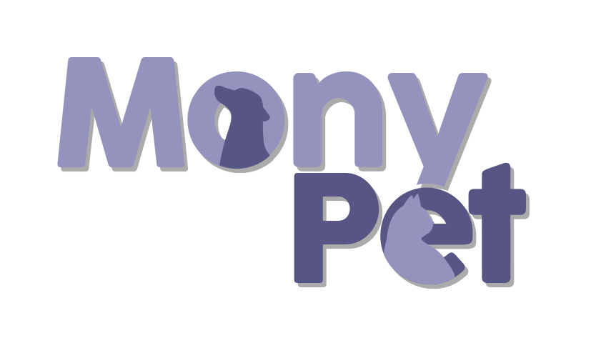

<p align="center">
  
</p>

<h4 align="center"> 
	✔️  MonyPet 🐕 Concluído ✔️
</h4>

<p align="center">
 <a href="#-sobre-o-projeto">Sobre</a> •
 <a href="#-tecnologias">Tecnologias</a> •
 <a href="#-funcionalidades">Funcionalidades</a> •
 <a href="#-aprendizados">Aprendizados</a> • 
 <a href="#-screenshots">Screenshots</a> •
 <a href="#-instalação">Instalação</a> • 
 <a href="#-roadmap">Roadmap</a> • 
 <a href="#-autores">Autores</a> • 
 <a href="#-suporte">Suporte</a> • 
 <a href="#-licença">Licença</a>
</p>

# 🐕 Sobre o projeto

O projeto “MonyPet” tem como principal objetivo o monitoramento contínuo do pet, utilizando-se de diversas funcionalidades, tais quais como o sistema de agendamento de eventos, com lembretes e avisos. <br>

Ao entrar, no aplicativo o usuário será direcionado ao tutorial, onde lá haverá uma rápida explicação sobre o aplicativo. Após isso, poderá escolher entre um dos pets já cadastrados, ou cadastrar um novo animalzinho. Selecionando a opção de novo pet será levado a tela de adição de pet, que necessariamente precisa do nome, se é cachorro ou gato, idade, e raça, e sem a obrigatoriedade, uma foto e o peso. <br>

Cada animal tem sua própria home, com seus próprios horários e registros, assim, facilitando a organização daqueles que possuem múltiplos animais. <br>

A análise gráfica é uma das principais propostas do aplicativo, onde de forma intuitiva e rápida haverá uma análise de todos os registros da semana, mês e ano. A agenda é algo simples, com opção de agendar lembretes e eventos do dia, facilitando a organização com a opção de formar lembretes. Os registros são pequenos informativos diários da qualidade de vida do pet, onde se avalia de 1 a 5 o dia a dia do animal em alguns tópicos com diferentes aspectos diários.

## 💻 Tecnologias

**Front-end:** React Native 

**Back-end:** JavaScript


## 🛠 Funcionalidades

- Adição de vários pets
- Armazenamento de dados do pet (Nome, idade, raça, foto, etc.)
- Monitoramento animal (Humor, bagunça, alimentação, etc.)
- Análise gráfica de aspectos monitorados
- Sistema de agenda de compromissos
- Notificação de compromissos


## 🧩 Aprendizados

O que você aprendeu construindo esse projeto? Quais desafios você enfrentou e como você superou-os?


## 📷 Screenshots
<p style="display: flex;">
	<image width="250px" height="450" src="https://play-lh.googleusercontent.com/bvrPwNzyqH80JPJrl6LytSjkrcUe3f0S2QSbIKHj9D-ZWNWrwXl3g1I-V9XFD99_-w=w2560-h1440-rw"/>
	<image width="250px" height="450" src="https://play-lh.googleusercontent.com/bbaStO_pzqVuDCPEMnEWW9oQJzn_JYGnAmyBG4oPiJ-eH6BQywFTN5AshqMvPP6xRQ=w2560-h1440-rw"/>
	<image width="250px" height="450" src="https://play-lh.googleusercontent.com/tOLfV8l35Gu9wHz64inXpWnub84-kMAOMu88X8YnC6ZJ61hu3YP7TdVXzaPLI7PFvt0=w2560-h1440-rw"/>
	<image width="250px" height="450" src="https://play-lh.googleusercontent.com/DjdTiSaFm3XSGAPvpP7V14d2IsnKQh9_NGxm5vNs0LiD5uwpgu0lW8xtVkGulYJ2ZQ=w2560-h1440-rw"/>
</p>

## 📥 Instalação

Instale my-project com npm

```bash
  npm install my-project
  cd my-project
```
    
## 🗺 Roadmap

- Melhorar o suporte de navegadores

- Adicionar mais integrações


## 👨‍🎓 Autores

- [@octokatherine](https://www.github.com/octokatherine)


## 📧 Suporte

Para suporte, mande um email para fake@fake.com ou entre em nosso canal do Slack.


## 📃 Licença

[MIT](https://choosealicense.com/licenses/mit/)

